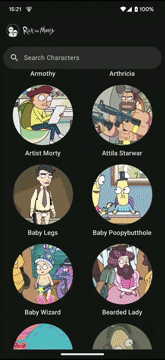

# WubbaLubbaDubDub – The Ultimate Rick and Morty Multiverse Explorer!  

    

**Hey Morty, get over here! We got an app, Morty! An app that lets you dive into the infinite insanity of the Rick and Morty multiverse!**  
It’s called **WubbaLubbaDubDub**, and it’s like having an interdimensional portal gun—but, you know, for *browsing characters* instead of making bad life choices.  

    

---

## 🛸 Search the Multiverse in Real Time!  
- Type a name, and BOOM! The app swaps out the word **“Rick”** with your search term and instantly updates results.  
- *Yeah, yeah, we get it—your fingers are too fast for the internet.* Don’t worry, results update **after every keystroke** without skipping a beat.  
- No more existential dread waiting for results—there’s a **progress indicator** that lets you know something’s happening, but without freezing the whole app like some glitchy Meeseeks.  

---

## 🧬 Character Profiles—Because Knowledge is (Interdimensional) Power!  
Tap a character and get hit with a **full-blown detail view**, packed with everything your squishy Earth brain needs:  

✔ **Name** – Big, bold, and in-your-face like Rick after three Flurbos of Schnapps.  
✔ **Full-width Image** – *BEHOLD* their glory in all its pixelated magnificence.  
✔ **Species** – Because you gotta know if you’re dealing with a Gromflomite, a Squanchy, or just another basic human.  
✔ **Status** – Alive? Dead? *Schrödinger’s Beth?* You’ll find out.  
✔ **Origin** – Know where they came from before they got caught up in some wacky sci-fi nonsense.  
✔ **Type (if applicable)** – Some characters are more than meets the eye—like how Mr. Poopybutthole is *not* a parasite (we think?).  
✔ **Formatted Creation Date** – Because *who doesn’t* want to know when an API thought this character should exist?  

---

## 🔧 Under the Hood – Built with **100% Schwifty Technology!**

Yeah, yeah, you don’t just want to *use* the app—you want to **know what makes it tick**? Fine, nerd. Here’s the rundown of the *juicy* tech stack that makes **WubbaLubbaDubDub** the **SchwiftOS 3000** of character browsers:

### 🟣 **Kotlin** – The DNA of this app!
Written in **Kotlin**, because Java is for Boomers and we like our code concise, expressive, and ready to traverse infinite dimensions without NullPointerException-ing itself into oblivion.

### 🔵 **Jetpack Compose** – UI that makes even Birdperson shed a tear
The UI is powered by **Jetpack Compose**, Google’s declarative UI toolkit. No more fighting with XML like a primitive—just **Composable** functions making everything look slicker than a freshly waxed Plumbus.

### 🟢 **Compose Navigation** – Portals for seamless screen transitions
Multi-screen navigation? Done **the right way** using **Compose Navigation**—smooth transitions, no unnecessary ceremony, and absolutely *zero* interdimensional travel mishaps (looking at you, Cronenberg World).

### 🟡 **Ktor** – API calls faster than Rick's portal gun
We fetch all that juicy **www.rickandmortyapi.com** data using **Ktor**, because networking should be **fast, clean, and coroutine-powered**—unlike that spaghetti mess Jerry wrote last weekend.

### 🟠 **Coil** – Because even character images deserve efficiency
Character images load via **Coil**, the *best* way to load images in Kotlin. Glide and Picasso? *Please!* We’re in the **future**, Morty! Coil is **fast, lightweight**, and optimized for **Jetpack Compose**.

### 🔴 **Hilt** – Dependency injection so easy, even Jerry could use it
You think we manually instantiate dependencies? **Pfft!** We use **Hilt** to handle all that garbage for us—clean, modular, and perfect for a universe where *efficiency is king*.

### 🟣 **Material3** – For that sexy next-gen UI
Rick doesn’t do outdated UI, Morty. This app runs on **Material3**, so everything looks sleek, modern, and polished—like an app *actually* made in this dimension.

### 🟢 **Paging3** – Because infinite scrolling needs to be *tight*
There are *way too many characters* to load all at once, so we use **Paging3** to **efficiently** fetch them, keeping performance smoother than Rick’s latest scam. No lag, no wasted resources—just results, *fast*.

### 🔵 **SLF4J** – Because logs should be readable, not interdimensional gibberish
Debugging is inevitable, but at least **SLF4J** makes logs readable *without* requiring a high-IQ, multiversal translator. Clean logs, happy devs, and fewer headaches.

### 🟡 **Kotlin Serialization** – No nonsense, just data
API responses get **decoded like a pro** using **Kotlin Serialization**—no clunky reflection nonsense, just **fast, efficient, and type-safe** JSON parsing.

---

## 🚀 TL;DR – Just Download It, Morty!

Look, if you don’t download **WubbaLubbaDubDub**, I don’t know what to tell you—maybe you belong in the **Jerryboree** daycare.  
But if you *do* get it? Well, you might just earn yourself a *tiny, fleeting* moment of happiness before the crushing weight of reality sets in.

🔬 **DOWNLOAD NOW!** (Or don’t. Time is meaningless, Morty!)